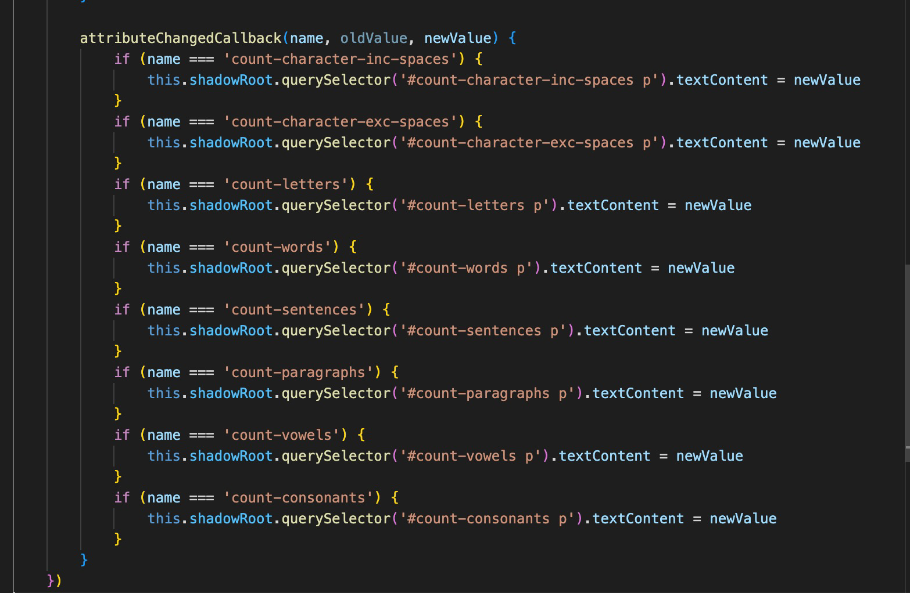
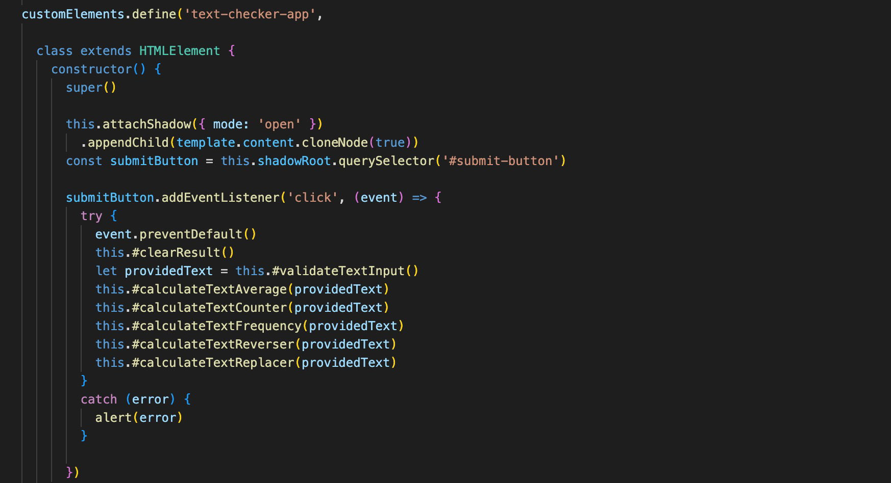
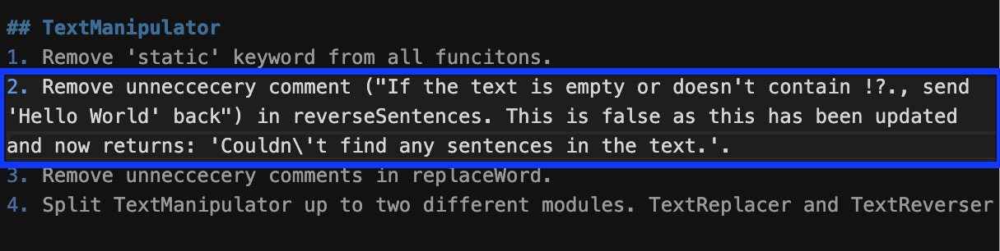
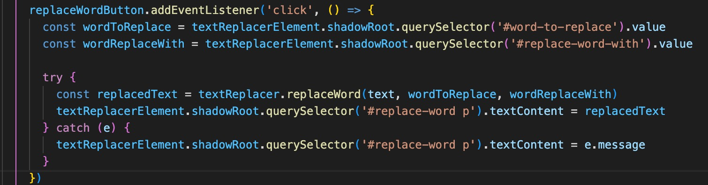
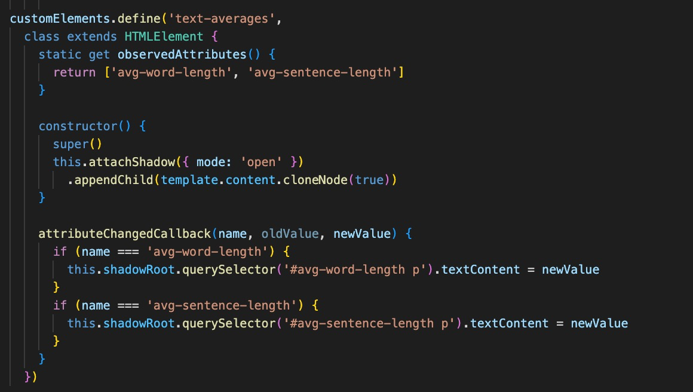
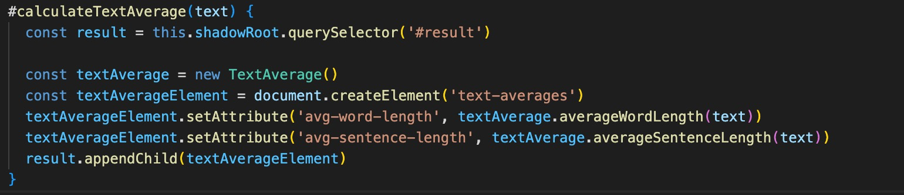

# Reflection

For this reflection, I have chosen to not refactor the code but instead highlight some of the shortcomings of it and what I could have done better.

## Chapter 2: Meaningful Names

This chapter highlight the importance of choosing names carefully to reflect the intent of the code and make it more understandable.

To reflect the intent of the code, the developer can write Intention-Revealing Names by writing names that reveal what the code intends to do or represent (p. 18).

Looking at the function names in `text-checker-app.js`, such as `#validateTextInput`, `#calculateTextAverage`, and `#clearResult`, they are quite intention-revealing. They provide clear insight into what each function does.

The same type of intention reavling names can also be found in, for example, `text-counters.js`, where all the names in `text-counters.js` starts with 'count-' and then ends with what it is being counted, to provide structure and clearity.



It is also important for the developer to Make Meaningful Distinctions (p. 20), and avoid names that are non-informative.

Variable names in `text-checker-app.js`, like `textCounterElement`, `textCounter`, `textAverageElement` and `textAverage` distinctively indicate their purposes without being redundant or similar sounding.

As code is often read and used by other developers, we must keep that perspective in mind when we write our code and should be usig Pronounceable Names (p. 21) and Use Searchable Names (p. 22) helps to foster communication between developers.

The function names and variable names in `text-checker-app.js` are both pronounceable and easily searchable, which aids in verbal discussions about the code and when searching through a large codebase.

In conclusion, the code in the application adherds to guidelines from Chapter 2: Meaningful Names.

## Chapter 3: Functions

To adequatly follow the guidelines from Chapter 3: Functions, some refactoring would be need to be made to the code in text-checker-app.js.

However, I have chosen to not refactor the code but instead highlight some of the shortcomings of it and what I could have done better.

Per the book, Functions should be small, doing only one thing and the smaller the better (p. 34).

Several functions in the code, such as `#validateTextInput` and `#clearResult`, are concise and focused, but there are other larger methods like the constructor and `#calculateTextReplacer` which could be refactored into smaller, more focused functions.

Functions should also not mix levels of abstraction, One Level of Abstraction per Function (p. 36) aiding in readability and maintainability.

While many functions adhere to this rule, the constructor mixes both high-level (like text processing) and low-level (like event handling) operations and could therefor be concidered to breaking the guideline of operating at a single level of abstraction.



A more structured approach would involve creating separate functions for setup (low-level operations) and processing (high-level operations). Something like:

```constructor() {
    super()
    this.#setupElements()
    this.#setupEventListeners()
}

#setupElements() {
    // Attatch the shadow DOM
}

#setupEventListeners() {
    // Select and set up event listner for the button
}

#handleSubmitClick(event) {
    // When clicked prevent default
    // Clear previous result
    // Get the validated text
    // Call calculateTextMetric
}

#calculateTextMetrics(text) {
    // this.#calculateTextAverage(text)
    // this.#calculateTextCounter(text)
    // etc.
}
```

There is also a recurring pattern of querying the shadow root for the #result element, which breaks the Don’t Repeat Yourself (p. 48) rule.

`const result = this.shadowRoot.querySelector('#result')`

This repetitive logic can be refactored into a separate helper function for clarity and DRYness.

There are also other improvements that can be made to the code in `text-checker-app.js`, for example, the sequence of function definitions could be reordered for better readability per the The Stepdown Rule (p. 37), mentioning that code should read like a narrative, going from high-level concepts to details.

I have instead tried to organize the code in accordance to the UI, so that the code that is used on top of the page is shown first. I think this approach might be comfortable for beginners, as the UI gives a visual clue on where to look in the code, but it might not be applicable for larger projects and as the project grows or when working with other developers.

## Chapter 4: Comments

When reading Chapter 4: Comments I first didn't agree with it.

In previous courses we have used JSDOC and comments extensively do capture the intent of the code, which per the book can cause more problems then it is helpful. Per the section Scary Noise (p. 66), it can lead to cut-paste errors Noise Comments (p. 64) and Misleading Comments (p. 63).

As I said, I was sceptical to the guidelines the book provided about, as I interpreted it; Making the code speak for itself, and not the comment.

However, I then saw that I had made the exact mistake the book calls out in Misleading Comments (p. 63).

In the Text Checker module I had a comment on line 43 in `TextManipulator` that said:

`// If the text is empty or doesn't contain !?., send 'Hello World' back`

However, this was probably a leftover from testing and I had updated the code to return: 'Couldn\'t find any sentences in the text.', but I hadn't captured that in the comment. Just like the book said could happen and why we should stay away from comments.



The misstake is called out in the `issue-log-text-checker.md`.

For this assignment, I have therefore used comments sparingly and relied more on making the intentions clear in the code.

## Chapter 5: Formatting

This chapter focuses on the importance of formatting in code, as good formatting improves the readability, understandability, and maintainability of the code.

As previously, I have chosen to not refactor the code but instead highlight some of the shortcomings of it.

In terms of Vertical Formatting (p. 76) and how code is organized vertically in a file, which affects how readers scan and understand the flow of the code, the class structure seek to mirror the Newspaper Metaphor (p. 77), opening with the constructor, similar to a headline, and subsequently diving into the details through helper functions.

There is Vertical Openness Between Concepts (p. 78) with spaces separating method definitions, fostering a readable flow. Within the methods, the code is Vertically Dense (p. 79), bundling related lines closely.

The code in `text-checker-app.md` is 175 code lines long, and while we should first look at what responsibilities the class has before deciding if the class should be split into smaller classes, I think that, when the codes reaches about 200 lines, it might be a good idea to have that conversation, so the classes doesn't become big with too many responsbiblities.

In terms of Horizontal Formatting (p. 85), programmers clearly prefer short lines, and some lines in the code, like `const wordReplaceWith = textReplacerElement.shadowRoot.querySelector('#replace-word-with').value` could use some separation to enhance the readability.

## Chapter 6: Objects and Data Structures

The code mostly uses object-oriented design, meaning it uses objects to perform actions.

Data Abstraction (p. 93) is about the principles of data abstraction that allow developers to ignore the implementation. This abstraction facilitates changes without affecting dependent code.

The use of classes like `TextInputValidator`, `TextAverage`, and so forth, does encapsulate their behavior, allowing callers to remain unconcerned with the inner workings of text validation, average computation, etc.

The Law of Demeter (p. 97) is a guideline to ensure that modules don't reach into other objects. In simple terms: Only talk to your immediate friends. There is also guidelines when it comes to Train Wrecks (p. 98) which are decribed as long chains of method calls or data accesses, like `a.b().c().d().` that should be avoided in the code.

The code I wrote has instances where these principles are stretched, especially when querying the DOM. For example `const wordReplaceWith = textReplacerElement.shadowRoot.querySelector('#replace-word-with').value`. As this can make the code harder to maintain, instances like these should preferble be refactored and encapsulated.



## Chapter 7: Error Handling

In line with the recommendation to Use Exceptions Rather Than Return Codes (p. 104), the `text-checker-app.js` code prominently uses exceptions instead of return codes. By incorporating try-catch blocks, especially within event listeners, the code effectively distinguishes its main logic from error handling.

And in regards to Write Your Try-Catch-Finally Statement First (p.105), the event listeners, like the one on `submitButton`, have `try-catch` blocks that encompass almost all their logic, which ensures that any runtime error doesn't break the UI experience, which reflects the importance of planning error handling from the outset.

![Try-catch block for the submitButton]images/image-3.png)

## Chapter 8: Boundaries

The book highlight in the section about Using Third-Party Code (p.114) that, when using third-party module, one should be cautious about direct dependencies because if the module changes, it could break the application, however, an abstraction layer can mitigate this.

As the module used for this application is one I have developed myself I found myself "in the right" to edit the module as I saw pleased the application. The changes I made was also documented in the [Issue Logger Text Checker](issue-log-text-checker.m)d to later be updated to the actual module.

This experiance related well to what I later read about Exploring and Learning Boundaries (p.116) as it mentions that, whenever you're trying to integrate with a new module or library, one should ideally write tests to understand its behavior and confirm its compatibility with the application, and how I, even though I had written the module I was using in the app, was baffeled that it didn't work they way I expected it to work when I tried to use it in the application.

## Chapter 9: Unit Tests

I didn't write unit tests for the application but I wrote it for the module and from my review of the unit tests I wrote for TextAverage, they to some extent embodied many of the principles from Chapter 9.

Allthough I didn't follow the Three Laws of TDD (p.122) and setting the foundation of my tests before the implementation, instead I used them to test that the code was working as I expected it to, however, the way I structured the tests in `TextAverages.test` was to have readable: clarity, simplicity, and density of expression, which aligns with Clean Tests (p.124), which ensures they're easy for any developer to understand.

Each test I composed also focuses on one concept, whether it's the average word length or sentence length, resonating with the Single Concept per Test guideline (p.131), and I've made sure to have only one assert per test (p.130) to be able to pinpoint any failures.

These measurements will aid in maintaining and refining the TextAverage class effectively, and any updated to the tests (as the module I used should be independent) has been documented in [Issue Logger Text Checker](issue-log-text-checker.m)d to later be updated to the actual module.

## Chapter 10: Classes

In terms of Class Organization (p. 136) the code in the application has multiple classes encapsulated within various modules (`TextAverage`, `TextCounter`, etc.), which is great for class organization because it breaks down complex functionality into manageable modules.

However, the primary class `text-checker-app.js` where most of the logic is, could use more organization, especially as it grows it can very quickly become overbearing.

I have also adheard to Encapsulation (p.136) with private methods, ensuring that these methods aren't accessible outside the class.

In terms of Single Responsibility Principle (p.138) the `TextAverage`, `TextCounter`, etc. is adhering to this principle by having a clear and focused responsibility. For instance, TextAverage only calculates averages.

The reason that the main class (`text-checker-app`) is not following this principle is because I thought it would be a good way to have the logic that is tied to this specific app in one place and to manage both UI and invoking methods. However, this tend to break the guideline of Classes Should Be Small (p.136). And while the other classes `TextAverage`, `TextCounter` has singular purpose, the main `text-checker-app` class is doing a lot.

It would be beneficial to break down some of the `text-checker-app` functionalities further to potentially smaller classes, and possibly consider organizing the listeners and UI manipulation code separately to keep the class small.



## Chapter 11: Systems

Separating the Construction of a System from Using It (p.154) means to seperate construction and usage, and mixing these two activities can lead to several problems, such as code that is harder to understand, test, and maintain. In the `text-checker-app` I have methods like this:



Here, the instantiation of the `TextAverage` class (`new TextAverage()`) is the "construction" part and immediately afterward I'm "using" it and is invoking methods on the `textAverage` instance, which can, as mentioned, have negative effects.

A straightforward solution would be to instantiate these classes once (during the construction phase) and store them as instance variables to be reused in the methods (usage phase).

```
constructor() {
    super()
    this.textAverage = new TextAverage()
}

#calculateTextAverage(text) {
    // Use this.textAverage without instantiating it again
    ...
}

```

Speaking of scaling up, the idea of Scaling Up (p.157) was a significant topic in the book. While it largely speaks to the broader aspects of software architecture, it reminded me to ensure that the code I write is ready for future scalability needs.

Looking at my own reflection from Chapter 3: Functions and Chapter 10: Classes, I uncovered some limitations in the code that would prevent me from build a scalable system as it is today. The code I have written up to this point would definitely benefit from some refactoring to make sure it is scalable for future use and that additional features can be added easy.
